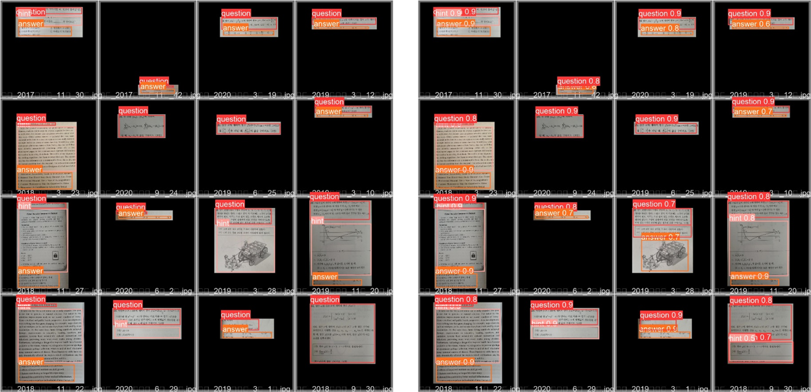
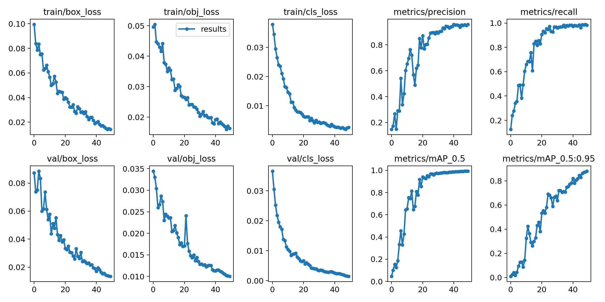

## Yolov5 실습

220916, torch==1.12.1 버전에서 돌도록 업데이트

## 1_train_yolo_colab_220916.ipynb 파일을 colab에서 수행한다

- 데이터셋 설정
  - train= custom train data path
  - val= custom valid data path
  - nc= 내 데이터의 클래스 개수
  - names= 내 데이터 클래스의 이름들

- Object Detection 예시

- Validation 결과 예시

- 학습 metric history

## ONNX, TensorRT 변환 완료(공식모델&Custom모델), 속도비교  

- Torch, ONNX, TensorRT 속도비교 (GPU: Tesla P100)

| Pytorch | ONNX | TensorRT |
|:---------:|:------:|:----------:|
|0.033s (30fps) | 0.015s (67fps) | 0.008s (125fps) |
|0.033s (30fps)| 0.056s (18fps) | 0.016s (63fps) 
